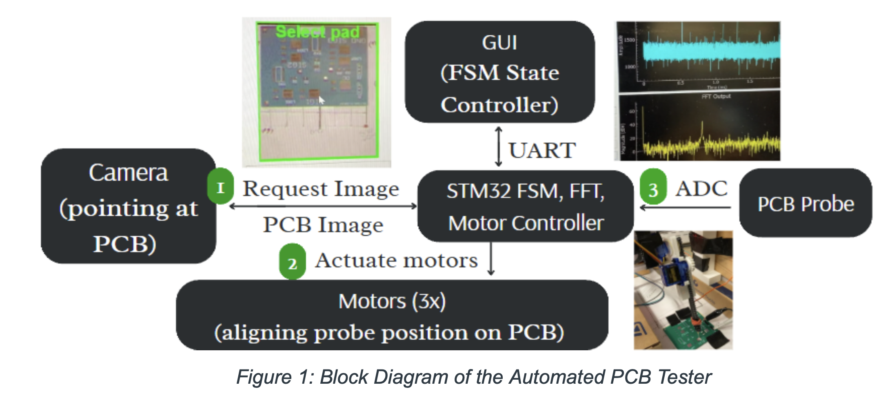

# Automated PCB Tester

**Authors:** Avani Yadav, Ryan Qi

This project prototypes an automated manufacturing-line machine for large-scale PCB validation. In the current design, the user captures an image and selects a pad to probe in Stage 1, the system actuates motors to position the probe in Stage 2, and then analyzes and visualizes the probed signal in Stage 3.



## System Overview

The tester combines a camera, GUI-based finite state machine controller, STM32 motor and FFT controller, motors for probe alignment, ADC-based signal capture, and a PCB probe workflow into a semi-automated validation pipeline. The concept is to let a user define a probing sequence once and then reuse that sequence across many identical PCBs.

## Workflow

1. Capture a PCB image and select a pad to probe.
2. Move the probe into position using stepper and servo motors.
3. Sample the signal with the ADC and analyze it using an FFT.
4. Send results back to the GUI for visualization and validation.

## Bandwidth Analysis

| Operation | Description | Minimum Time |
|---|---|---:|
| A: UART commands | GUI changes FSM state using a 10-byte fixed command echoed by the STM32 as a software handshake | 173.6 μs     |
| B: DCMI | DCMI runs at 168 MHz with a maximum data rate of 1,503,360 bytes/sec | 0.0746 ms     |
| C: Transfer image to GUI | 174x144 image, 16-bit pixels, 50,112 bytes per frame sent over UART | 4.35 s     |
| D: Stepper motor GPIO control | L298N driven using `HAL_GPIO_WritePin` with 100 Hz square waves and `HAL_Delay` | 4.05 μs     |
| E: Stepper move | Experimentally measured around 3 cm/s at 1 A and 100 Hz; typical motion dominates runtime | 1.5 s typical     |
| F: Servo I²C control | PWM write to PCA9685 takes about 6 bytes over I²C | ~600 μs     |
| G: Servo move | Servo speed is 0.1 s per 60° at 5V, or about 0.3 s over 180° | ~300 ms     |
| H: Timer-triggered ADC | 2048 samples, DMA-enabled, TIM2-triggered at 1 MHz, sampled at 1 MSps | 2.05 ms     |
| I: CMSIS M4 FFT | 2048-sample floating-point FFT on STM32 M4 with FPU and `-O3` optimization | 650–750 μs     |
| J: Transfer FFT and ADC data | 2048 × 4-byte FFT data plus 2048 × 2-byte ADC data over 115.2 kbaud UART | 1.07 s     |

## Power and Energy

The report identifies the best low-power-mode opportunities during non-CPU tasks such as GPIO, ADC, I²C, and UART by combining DMA, timers, and interrupts with SLEEP mode, while STOP mode is suggested for idle periods such as user or GUI delay    . Under a hypothetical workload of one user-programmed 50-pad sequence reused across 1000 PCBs, the estimated energy consumption drops from 27.8 kJ to 5.5 kJ, which is about 80% less energy when low-power modes are applied    .

The energy model is expressed as:

```text
Energy consumed = [Y+A+B+C+(Y+A+D+E+F+G+Y+H+I+J)*N+(A+D+E+F+G+H+I+J)*N*(X-1)]
```

Where:
- `Y` = STOP energy during idle time    
- `N` = 50 pads probed    
- `X` = 1000 PCBs    
- `{A...J}` = power consumption of each operation mode multiplied by its minimum time from the bandwidth analysis    

The report also states the following operating power values:
- RUN: 56.75 mA = 187.3 mW    
- SLEEP: 12.9 mA = 42.6 mW    
- STOP: 55 μA = 181.5 μW    

## Code Breakdown

| Module | Resource | Use |
|---|---|---|
| Camera | `ov7670.h` and `ov7670.c` from Lab 5 | Reused code, with color feature added independently     |
| Servo | PCA9685 interface | Modified existing PCA9685 functions for this project     |
| Stepper | N/A | Independently written     |
| ADC + FFT | ARM CMSIS FFT | Used FFT function and documentation     |
| FSM | UART RX/TX | Adapted into function-pointer FSM state transition logic     |

## Project Reflection

The original goal was automatic PCB pad detection through image processing, but the implementation shifted to user-selected probing through the GUI because of time constraints    . That tradeoff was considered acceptable because the system is intended to repeat the same probing sequence across many identical PCBs after the initial setup    .

The report also notes security and ethics concerns: high-resolution PCB images and signal data could expose proprietary layouts, so test reports should be encrypted and stored only with clear authorization, and future automation should be designed to support engineers rather than replace skilled labor outright    .

## Contribution Split

- **Ryan’s work:** Stepper motors, ADC, FFT, UART handshakes, GUI    
- **Avani’s work:** Servo motors, camera calibration, UART RX/TX configuration    
- **Combined work:** Colored images, FSM, motor calibration, mechanical CAD, and BOM    

## References

1. STMicroelectronics, “L298 – Dual Full Bridge Driver,” Oct. 2023.    
2. NXP Semiconductors, “PCA9685 – 16-channel, 12-bit PWM Fm+ I²C-bus LED controller,” Apr. 2015.    
3. STMicroelectronics, “Digital signal processing for STM32 microcontrollers using CMSIS,” Application Note AN4841, Feb. 2018.    
4. MicroPeta, “PCA9685 Interface Reference.”    
5. ARM, “CMSIS DSP Software Library.”    
6. STMicroelectronics Community, “Implementing UART receive and transmit functions on an STM32.”    
7. STMicroelectronics, “STM32CubeMX Power Consumption Calculator.”    
